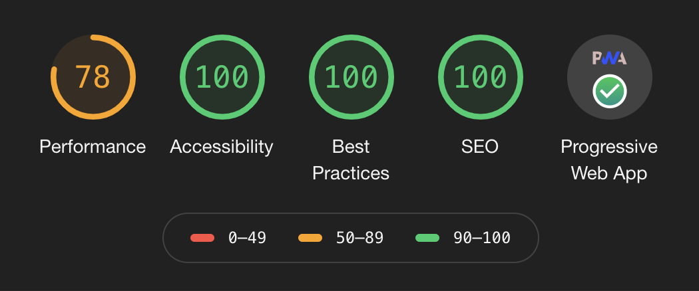

<h1 align="center">
  Technical Blog using Gatsby
</h1>

  
  

> A technical Blog created by Gatsby. You can use it to write non tech blogs as well

### [Check the Demo✨](https://that-it-guy.netlify.app)

# 🎁Features

1.  **gatsby-plugin-mdx**

To convert md files to websites

2. **gatsby-source-filesystem**

To access files in this folder using a graphQL api

3. **gatsby-image, gatsby-plugin-sharp, gatsby-transformer-sharp**

Its about making the saved images to different formats
And also loads the images lazyly while webpage is refreshed

4. **gatsby-plugin-styled-components**

Without this plugin all your styled components will become messy in gatsby.
Here is the gatsby bug that you kill using this
https://github.com/gatsbyjs/gatsby/issues/9911#issuecomment-450099671

5. **jquery to add hash links**

This allows you to have urls like this
https://that-it-guy.netlify.app/blogs/jquery-react#the-problem

6. **Themes to change to dark mode**

Done using Context. useContext. Context.Provider Context.Consumer

7. **Code Syntax**

- Code syntax highlighting using Highlight.js
- Adding a copy button for each code block

8. **Lazy loading**

- If you have too many posts it will try to load them one by one based on your screen scroll position

9. **Some other hooks**

useState, useContext, useCallback

10. **gatsby-plugin-playground**

You can use a nice UI for running graphql queries. Lot better than the default graphql UI.

11. **gatsby-plugin-react-helmet**

SEO. Create special meta for your root html website that helps BOTs detect your website and understand its purpose.

12. **gatsby-plugin-offline**, **gatsby-plugin-manifest**

2 Steps for making your website Progressive Web App:

- gatsby-plugin-manifest:

https://www.gatsbyjs.org/docs/progressive-web-app/#it-must-include-a-web-app-manifest
Gatsby provides a plugin interface to add support for shipping a manifest with your site.

- gatsby-plugin-offline:

https://www.gatsbyjs.org/docs/progressive-web-app/#it-must-implement-a-service-worker
Gatsby also provides a plugin interface to create and load a service worker into your site

# Lighthouse Score 💯

# 🖼 Screenshot and Design

## 🎨 Theming

## Syntax highlighting with Code copy

## Filter by Post Tags

# 💄 Styles

1. Mostly are Styled Components
2. And some material-ui
3. Some pure css styles

# 🚀 Deploy

