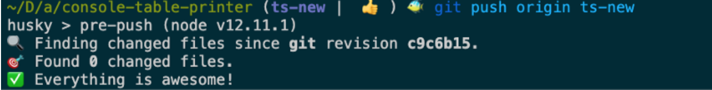

import CodeDivWrapper from "../../components/CodeWrapper/CodeWrapper";

The formatting is something everyone should follow same rules using some basic tools. In js world most popular formatter is prettier. Husky on top of it makes it just hussle less

# Prettier

## Installation

First install the thingy as dev dependency

<CodeDivWrapper>

```bash
npm install --save-dev prettier
```

</CodeDivWrapper>

Now add this config file `.prettierrc`

<CodeDivWrapper>

```json
{
  "endOfLine": "lf",
  "semi": true,
  "singleQuote": true,
  "tabWidth": 2,
  "trailingComma": "es5"
}
```

</CodeDivWrapper>

Now add this config file `.prettierignore` to ignore some files being formatted

<CodeDivWrapper>

```text
.cache
package.json
package-lock.json
public
```

</CodeDivWrapper>

run prettier on your Project

<CodeDivWrapper>

```bash
prettier --write \"\*_/_.{js,jsx,json,md}\"
```

</CodeDivWrapper>

add this as script in your package.json file to make your life easier


# Husky

Only having prettier means you have to format yourself. But maybe you want this formatting to be done automatically every time you push some code to git. Thats where husky comes in

## Installation

<CodeDivWrapper>

```bash
npm install pretty-quick husky --save-dev
```

</CodeDivWrapper>

## Config file

create file `.huskyrc.json` in root of the folder

<CodeDivWrapper>

```json
{
  "hooks": {
    "pre-push": "pretty-quick --staged"
  }
}
```

</CodeDivWrapper>

This will ensure every time you push your code to github your code will be formatted with husky.
After each push things will look like this



## Source: 

1. https://prettier.io/docs/en/precommit.html#option-2-pretty-quickhttpsgithubcomazzpretty-quick
2. https://www.npmjs.com/package/husky
