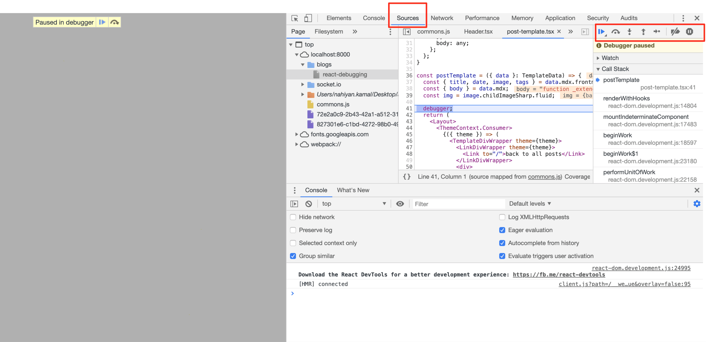
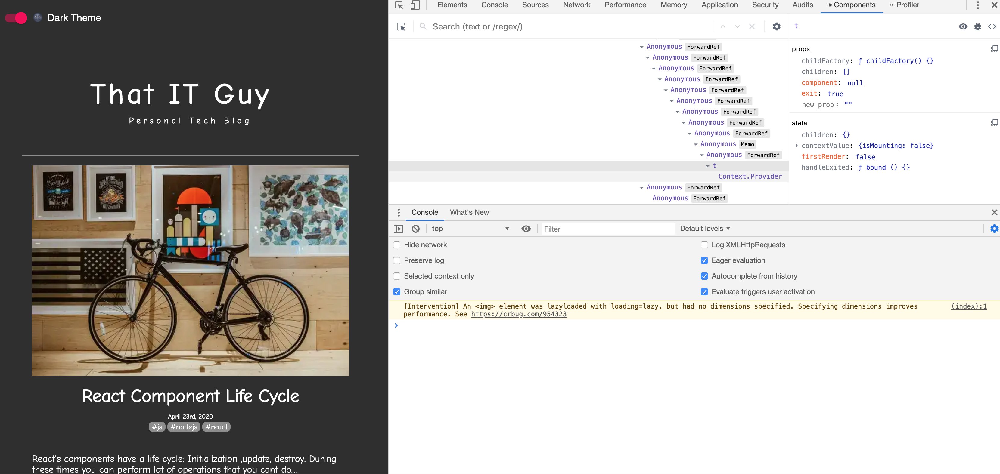
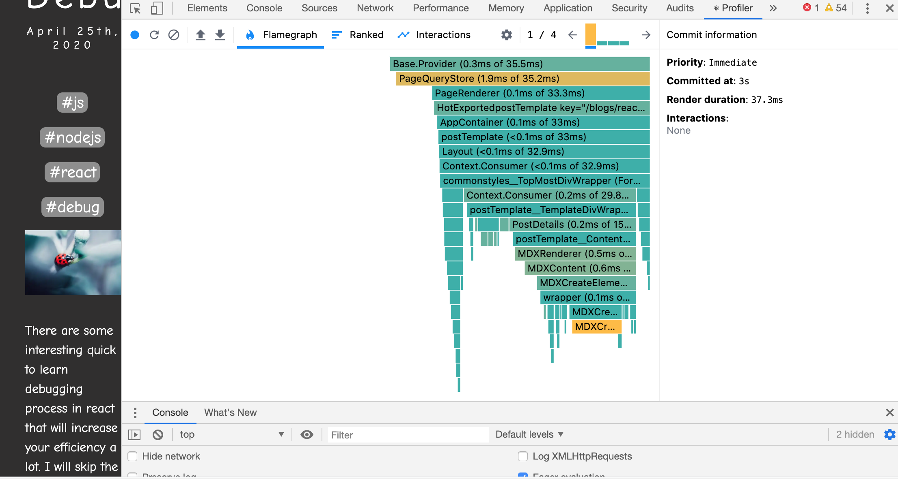

import CodeDivWrapper from "../../components/CodeWrapper/CodeWrapper";

import { Link } from "gatsby";

There are some interesting quick to learn debugging process in react that will increase your efficiency a lot. I will skip the console.log just to save time.

# Debugger statement

Just put this code in your react application

React has a cool chrome/firefox extension that is very good for debugging react components states and props.

<CodeDivWrapper>

```jsx
// Header.tsx
const Header = () => {
  debugger;
  return (
    <ThemeContext.Consumer>
      {({ theme, setTheme }) => (
        <NavBar>
          <NavSwitch
            theme={theme}
            onClick={() => {
              setTheme(revertThemes[theme.themeName]);
            }}
          ></NavSwitch>
        </NavBar>
      )}
    </ThemeContext.Consumer>
  );
};

export default Header;
```

</CodeDivWrapper>

Run the dev server. Once your code reaches that place your browser will stop there and look like this



You can simply move your cursor on top of those variables and you will be able to see the values of the variables. You can also set your breakpoints at this moment.

- You can change the variables value from the scope part. Then see how the code behaves
- You can also change your code directly and check it directly what happened here instaed of changing the source code.
- For breakpoints there are some other options like event listener

# Chrome/Firefox React developer tools

You can start your react server and check the states and Props using this tool for each react component.



Using this tool will show you the options components and Profiler.

- Components are the ones to track each components states and props
- Profiler helps for generating flamegraph of time take on each dom rendering



# Source

1. https://flaviocopes.com/javascript-debugging/
2. About devtools: https://developers.google.com/web/tools/chrome-devtools/javascript
