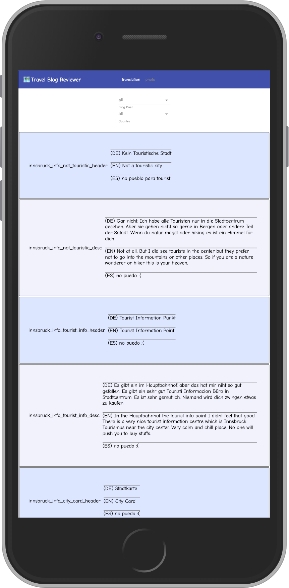

import CodeDivWrapper from "../../components/CodeWrapper";

Recently I got myself into this problem: When I deployed my website on mobile it looked like zoomed out as if the whole webpage is trying to fit into the phone. Although I created separate views for smaller devices still on mobile the view was shitty.

# Design

| ----------------------What I designed--------------------- | ---------------------What I got---------------------- |
| ---------------------------------------------------------- | ----------------------------------------------------- |
|                         |                        |

# Solution

Interestingly the solution was to look for a way to tell browser not to try to zoom out to fit everything in one page.

There is a special Tag you need to use to let browsers know about this. Its called viewport. After adding it the Problem was fixed

<CodeDivWrapper>

```html
<!DOCTYPE html>
<html lang="en">
  <head>
    ....
    <meta name="viewport" content="width=device-width, initial-scale=1" />
    ...
  </head>
  <body>
    <div id="root"></div>
  </body>
</html>
```

</CodeDivWrapper>
