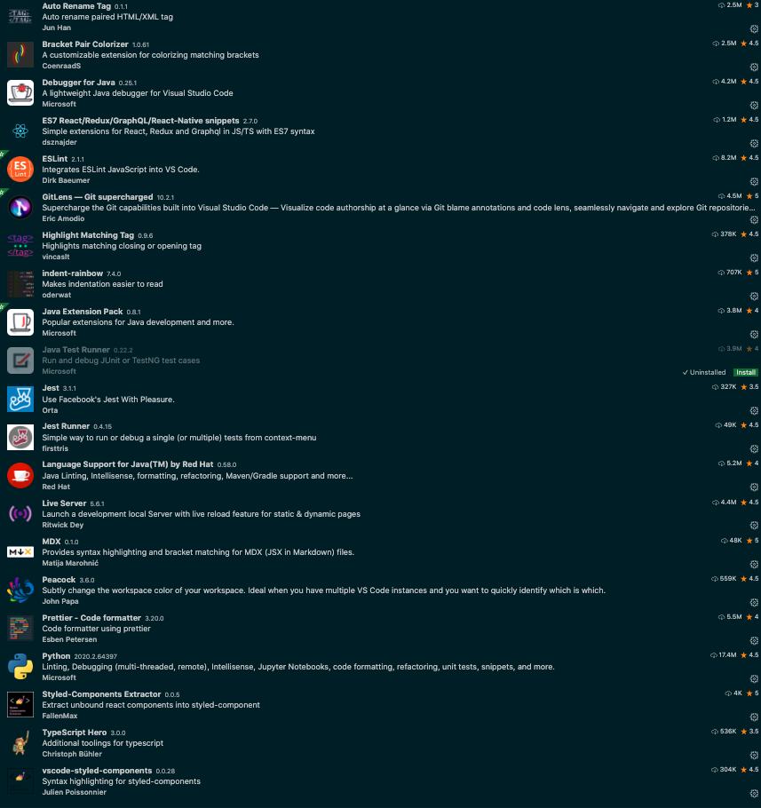

import CodeDivWrapper from "../../components/CodeWrapper";

Created by Microsoft this is a clear winner Editor for js/ts/nodejs/react what ever you say. I even use this for Simple Java Programs.

## Installation

Just download and install from official website

## Useful commands

`cmd + shift + p` => for searching for commands that are available with extensions

### Install code Command in PATH

This allows you directly from command line to open the folder as a project in vs code like this

<CodeDivWrapper>

```bash
code .
```

</CodeDivWrapper>

cmd + shift + p => search with code to install this feature

### useful shortcuts

<CodeDivWrapper>

```bash
cmd + p           goto file
cmd + shift + f   search for words in whole project
ctrl + -          go to previous cursor location
ctrl + =          goto next cursor location
_
```

</CodeDivWrapper>

# Extensions


